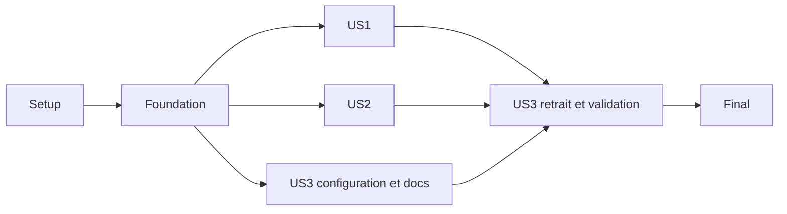

# Tasks: Migration Supabase

**Input**: Design documents from `specs/001-migrate-supabase/`
**Prerequisites**: plan.md, spec.md, research.md, data-model.md et contracts/.
**Tests**: Scénarios de la spécification et vérifications ciblées prévues par le plan.
Aucune obligation TDD supplémentaire. Les tests de configuration ne contactent pas de serveur.
**Organization**: Tâches par user story ; préparation du schéma partagée en fondation.

## Format: `[ID] [P?] [Story] Description`

`[P]` indique des fichiers distincts et aucune dépendance mutuelle, une fois leurs
prérequis terminés. Les labels US1/US2/US3 correspondent aux scénarios de spec.md.
Tous les chemins sont relatifs à la racine du dépôt.

## Phase 1: Setup (Shared Infrastructure)

**Purpose**: Confirmer le contexte, sans interroger la base locale.

- [X] T001 Vérifier versions, scripts et chemins de compilation dans apps/api/package.json, apps/api/tsconfig.json, mise.toml et bun.lock ; consulter la documentation installée correspondant aux versions et consigner les écarts préexistants dans specs/001-migrate-supabase/quickstart.md sans modifier les dépendances indépendantes.
- [X] T002 Documenter dans apps/api/README.md le provisionnement d'un projet Supabase de test distinct de production, des rôles forest_app et de migration séparés et de leurs accès privés ; préciser TLS/CA, pooler session ou connexion directe, droits limités et absence de BYPASSRLS/DDL pour forest_app, sans mot de passe versionné ni opération sur la source locale.

## Phase 2: Foundational (Blocking Prerequisites)

**Purpose**: Connexion et préparation du schéma communes aux trois stories.

- [X] T003 Créer apps/api/src/database/database.config.ts comme parseur pur partagé API/CLI, avec DATABASE_URL et MIGRATION_DATABASE_URL séparées, validation postgres/postgresql, TLS vérifié et CA facultative, refus des paramètres URL SSL contradictoires, pool 5, connexion 10000 ms et requête 15000 ms par défaut ; valider les entiers positifs, ne jamais exposer les valeurs et ne fournir aucun fallback localhost ou DB_USER/DB_PASSWORD/DB_NAME.
- [X] T004 [P] Créer apps/api/src/database/database.config.spec.ts pour les configurations manquantes/invalides, paramètres numériques, conflit SSL, fichier CA illisible et diagnostics sans secrets ; aucune connexion réseau, validation distincte runtime/migration.
- [X] T005 [P] Corriger uniquement le mapping de apps/api/src/users/user.entity.ts : id number avec type SQL integer explicite, « clé primaire, généré par séquence », firstName et lastName character varying « NOT NULL », isActive boolean « NOT NULL, défaut true » ; conserver public.user, les noms camelCase et le JSON existant, sans nouvelles contraintes métier.
- [X] T006 Créer apps/api/src/database/data-source.ts avec les entités et migrations explicites, configuration de migration uniquement, synchronize=false, migrationsRun=false et installExtensions=false ; éviter toute connexion à l'import et vérifier le chemin JS ESM compilé dist/src/database/data-source.js.
- [X] T007 Créer la migration horodatée dans apps/api/src/database/migrations/ pour public.user, sa séquence et l'historique TypeORM : reprendre les contraintes de T005, refuser une table existante non suivie, créer RLS/politique CRUD forest_app et grants limités, révoquer table/séquence pour PUBLIC, anon et authenticated ; ne toucher ni auth/storage ni les extensions UUID et ne déclencher aucun reset automatique en cas d'échec.
- [X] T008 Ajouter dans apps/api/package.json migration:run et migration:show avec chargement explicite du fichier env, CLI TypeORM sur DataSource JS compilé et propagation des erreurs sans secrets ; vérifier la résolution ESM sans ajouter ts-node.
- [X] T009 Créer apps/api/test/database-test-environment.ts et adapter apps/api/vitest.config.e2e.ts pour charger TEST_DATABASE_URL/TEST_MIGRATION_DATABASE_URL avant AppModule ; exiger TEST_DATABASE_CONFIRM_ISOLATED=true, rejeter le projet production et des cibles runtime/migration différentes, identifier le projet malgré les rôles ou endpoints différents, puis fermer les connexions après chaque suite.

**Checkpoint**: Configuration, schéma versionné et garde de cible disponibles.
Le provisionnement distant peut nécessiter des accès externes : ne pas déclarer les
vérifications distantes réussies si ces accès ne sont pas disponibles.

## Phase 3: User Story 1 - Conserver les opérations sur les utilisateurs (Priority: P1)

**Goal**: CRUD existant et persistance fonctionnels via Supabase.
**Independent Test**: Créer deux fiches, consulter liste et id, redémarrer, supprimer
une fiche et vérifier la seconde inchangée ; comparer aussi les comportements d'erreur.

- [X] T010 [US1] Ajouter les scénarios de caractérisation dans apps/api/test/users.e2e-spec.ts selon specs/001-migrate-supabase/contracts/users.md : statuts/corps CRUD, GET inconnu, identifiant non numérique et création incomplète ; utiliser seulement la destination isolée, ne pas lancer la source locale, consigner toute baseline non exécutable au lieu d'inventer un résultat avant migration.
- [X] T011 [US1] Adapter apps/api/src/app.module.ts à database.config.ts et au rôle runtime seulement ; supprimer les credentials locaux codés dans le module, forcer synchronize=false, migrationsRun=false et installExtensions=false, configurer TLS, pool/délais et trois tentatives maximum de connexion sans DDL au démarrage.
- [X] T012 [US1] Assainir les diagnostics dans apps/api/src/main.ts et apps/api/src/database/database.config.ts ainsi que le logger TypeORM/Nest utilisé par apps/api/src/app.module.ts : catégoriser les échecs sans URL, mot de passe, paramètres SQL ni objet brut du driver ; préserver les réponses publiques existantes et sortir en échec si le démarrage échoue.
- [X] T013 [US1] Compléter apps/api/test/users.e2e-spec.ts avec persistance après fermeture/réouverture de l'application, suppression ciblée et isolation de deux fiches ; appliquer les migrations explicitement avant le parcours, nettoyer uniquement les identifiants créés par la suite et conserver les controllers/services sauf adaptation indispensable au mapping.
- [ ] T014 [US1] Exécuter les contrôles API build/lint/test et les scénarios CRUD sur cible isolée ; consigner statuts, erreurs, persistance et éventuels écarts dans specs/001-migrate-supabase/quickstart.md sans résultat distant revendiqué si les accès manquent.

**Checkpoint**: US1 peut être démontrée sans supprimer l'ancien dossier ni exécuter de reprise locale.

## Phase 4: User Story 2 - Préparer la destination sans reprise de données (Priority: P1)

**Goal**: Préparation reproductible et erreurs non destructives, sans lire la source.
**Independent Test**: Appliquer la migration, la relancer sans doublon, créer une fiche
et vérifier un conflit sur une cible jetable séparée ; aucun inventaire/export local.

- [X] T015 [P] [US2] Créer apps/api/test/database-migrations.e2e-spec.ts pour première application, seconde exécution sans changement, création sans collision, refus de table user non suivie et conservation de ses données lors d'un échec ; le scénario de conflit utilise une cible jetable distincte, jamais DROP/TRUNCATE d'une table existante partagée.
- [X] T016 [P] [US2] Créer apps/api/test/database-permissions.e2e-spec.ts vérifiant CRUD forest_app, refus DDL et accès auth/storage, absence de lecture/écriture anon/authenticated sur user et absence d'accès à la séquence ; fermer toutes les connexions et ne nettoyer que les fiches de la suite.
- [X] T017 [US2] Compléter apps/api/README.md avec les commandes exactes de provisionnement sans secrets et migration:show/run, prérequis de propriétaire/grants pour le rôle de migration, activation SSL enforcement et option de désactivation Data API sur projet dédié seulement ; documenter l'arrêt sur conflit et l'absence de rollback destructif automatique, sans sauvegarde ou récupération locale.
- [ ] T018 [US2] Vérifier sur le projet de test la préparation, les permissions et TLS avec CA erronée, credentials refusés et endpoint inaccessible ; si Data API active, vérifier aussi son refus avec une clé publique sans la logger ; consigner les résultats et délais/tentatives bornés dans specs/001-migrate-supabase/quickstart.md.

**Checkpoint**: Préparation indépendante du CRUD HTTP, sans dépendance à PostgreSQL local.

## Phase 5: User Story 3 - Développer sans l'ancien service local (Priority: P2)

**Goal**: Dépôt et démarrage autonomes vis-à-vis de infra/db.
**Independent Test**: Depuis une copie du dépôt, suivre la configuration documentée,
démarrer sans ancien service local et réussir création/consultation.

- [X] T019 [P] [US3] Créer apps/api/.env.example selon specs/001-migrate-supabase/contracts/database-configuration.md avec toutes les variables runtime/migration/test et des valeurs factices ; conserver les secrets réels hors dépôt et vérifier les exclusions env dans .gitignore.
- [X] T020 [P] [US3] Actualiser apps/api/README.md avec installation Bun, configuration, compilation, migrations, démarrage PORT=3001 pour éviter le port frontend, contrôles et résolution des erreurs ; aucune commande locale de base ou credential exposé.
- [ ] T021 [US3] Après T014 et T018 réussies, identifier le conteneur et le volume dédiés depuis infra/db/docker-compose.yml et les métadonnées de ressources ; supprimer uniquement ce service/stockage autorisés, sans inspection du contenu, sauvegarde ni prune global, et noter le résultat non sensible dans specs/001-migrate-supabase/quickstart.md.
- [ ] T022 [US3] Supprimer infra/db/ et retirer son entrée de workspace dans package.json ; régénérer bun.lock avec Bun sans upgrade indépendant et vérifier l'absence de @forest/db et de dépendances actives dans les manifests et instructions, en préservant les mentions historiques des specs.
- [ ] T023 [US3] Exécuter depuis une copie du dépôt bun install --frozen-lockfile et le démarrage documenté sans ancien service, puis création/consultation ; consigner dans specs/001-migrate-supabase/quickstart.md le résultat, l'absence de fallback et l'indépendance après suppression locale.

**Checkpoint**: Ancien dossier et ressources dédiées retirés ; données Supabase et autres services préservés.

## Phase 6: Polish & Cross-Cutting Concerns

- [X] T024 Rejouer une fois les contrôles applicables après les dernières modifications dans apps/api/package.json et package.json, vérifier le diff/lockfile et l'absence de secrets ; consigner les échecs préexistants séparément dans specs/001-migrate-supabase/quickstart.md.
- [X] T025 Mettre à jour specs/001-migrate-supabase/quickstart.md avec les commandes réellement livrées et les preuves SC-001 à SC-006, en distinguant exécution, échec et prérequis manquants ; confirmer l'exception constitutionnelle limitée à la source vide et ne cocher les tâches distantes qu'après exécution réelle.

## Dependencies & Execution Order

- Setup : T001 → T002. Aucun accès à la base locale.
- Foundation : T003 → (T004, T005) → T006 → T007 → T008 → T009.
- US1 : T010 → T011 → T012 → T013 → T014.
- US2 : (T015, T016) → T017 → T018.
- US3 : (T019, T020) → T021 → T022 → T023.
- Final : T024 → T025.

Les trois stories démarrent après la fondation. US1 et US2 sont vérifiables séparément
sur des cibles dédiées, mais les validations T014 et T018 nécessitent le projet, les rôles
et la migration de fondation. US3 peut préparer ses docs en parallèle ; son retrait
T021–T023 dépend du succès de US1 et US2, conformément à FR-009.
Ne pas exécuter simultanément deux suites mutantes sur le même schéma de test.

## Parallel Example: User Story 1

Après fondation, T010 (tests US1) peut être préparée en parallèle de T015/T016 (tests US2),
fichiers distincts. T011–T012 restent séquentielles : mêmes modules de configuration.
Aucune parallélisation interne artificielle pour ce petit CRUD.

## Parallel Example: User Story 2

T015 et T016 peuvent être écrites en parallèle, dans deux fichiers distincts, après T009.
Leur exécution distante doit utiliser des cibles distinctes ou être séquentielle.

## Parallel Example: User Story 3

T019 (.env.example et exclusions env) et T020 (README) sont parallélisables après la
fondation. T020 commence après T017 si US2 travaille déjà sur le même README.
T021–T023 restent séquentielles : les métadonnées Compose sont nécessaires avant suppression.

## Implementation Strategy

### MVP First

Livrer Setup + Foundation + US1 pour un CRUD Supabase démontrable, sans supprimer la
source ni le dossier. Inclure impérativement TLS, permissions et migrations de fondation.
La suppression complète demandée nécessite ensuite US2 et US3 ; le MVP seul n'achève pas
la feature. Il ne vaut pas autorisation de déploiement public des routes sans authentification.

### Incremental Delivery

Préparer configuration/schéma, valider CRUD, confirmer répétabilité et permissions,
puis retirer l'infrastructure locale et suivre le guide depuis une copie du dépôt.
Les accès distants manquants bloquent seulement les opérations concernées ; progresser
sur le code et les docs indépendants sans inventer de validation et sans supprimer le
dossier avant le checkpoint distant requis par la spécification.

## Notes

- Traçabilité : FR-001/002/003 → T005, T010–T014 ; FR-004/005 → T003/004, T011/012, T019 ; FR-006 → T006–T008, T015/017 ; FR-007 → aucune tâche de reprise locale ; FR-008/013 → T012, T015, T018 ; FR-009/010 → T021–T023 ; FR-011 → T019/020/023 ; FR-012 → T007/009/016/018.
- Les noms horodatés de migrations seront fixés à leur création sous le dossier indiqué.
- Le rôle migration doit pouvoir créer la table d'historique ; le runtime ne doit pas posséder les tables.
- Aucun ajout d'Auth, Storage, Realtime, Prisma, nouvelle validation métier ou écran frontend.
- La suppression locale est autorisée ; les limites d'exécution de l'environnement restent applicables.

## État d'exécution — 2026-10-05

20 tâches réalisées localement. T014, T018, T021, T022 et T023 restent ouvertes :
les URLs et accès Supabase ne sont pas configurés. Aucun checkpoint distant n'a été
validé ; les suites e2e refusent la cible non déclarée isolée. Le retrait local reste
conditionné à T014/T018 conformément à la spec. Aucune inspection de la source locale.
Le runner migre via l'API TypeORM compilée plutôt que sa CLI brute pour filtrer les erreurs.
Le chemin réel est dist/database/migrate.js, confirmé par tsconfig.build.json.
